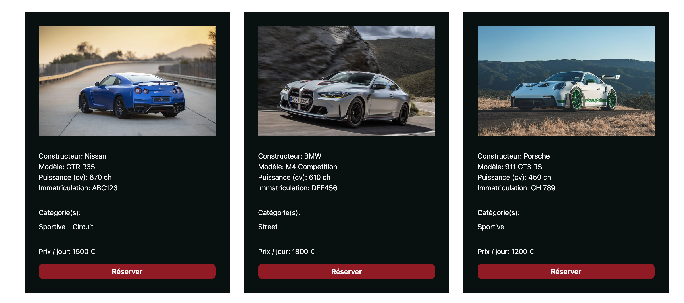

# Projet de Gestion de Réservations

Ce projet est une application de gestion de réservations, où les utilisateurs peuvent s'inscrire, se connecter, réserver des véhicules sportifs de rêve et gérer leur profil.

## Fonctionnalités

- **Authentification Utilisateur**: Les utilisateurs peuvent créer un compte et se connecter.
- **Réservation de Services**: Les utilisateurs peuvent réserver différents services disponibles.
- **Gestion du Profil**: Les utilisateurs peuvent modifier leurs informations personnelles et leur mot de passe.
- **Suppression de Compte**: Les utilisateurs peuvent supprimer leur compte.

## Spécifications Techniques

- **Technologies Utilisées**:

  - HTML
  - CSS
  - JavaScript
  - PHP avec PDO, architecture MVC, POO...
  - MySQL
  - MAMP (serveur Apache / PHPMyAdmin)

  Aucun framework ni package n'a été utilisé dans le cadre de ce projet.

## Installation

1. Clonez le dépôt sur votre machine locale.
2. Importez la base de données fournie dans votre système de gestion de bases de données.
3. Configurez les informations de connexion à la base de données dans le fichier `config.php`.
4. Lancez l'application depuis votre serveur local.
5. Si vous n'êtes pas sur Mac et/ou n'utilisez pas MAMP, vous devrez probablement changer certains liens pour correspondre à votre configuration.

## Auteur

Ce projet a été réalisé par dans le cadre de ma formation de Concepteur et développeur d'applications à Simplon Grenoble.

---

📅 Date de Création: 18/03/24 - 29/03/24 (~10 après-midi)

🛠️ Dernière Modification: 29/03/24
